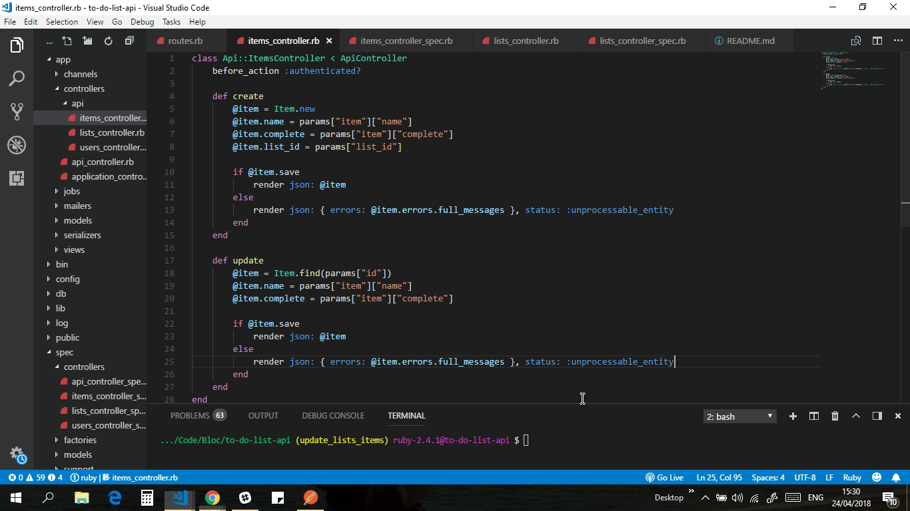

# To-Do-List-API

small description



[Case Study](https://samibirnbaum.com/portfolio/samipedia.html)

## Usage

1. Fork and clone the repo: `git clone https://github.com/samibirnbaum/samipedia.git`
2. You must have Ruby installed (built using version 2.4.1)
3. Run `$ bundle install` to download/install the needed dependencies
4. Start the local server: `$ rails s` = `http://localhost:3000`
5. Make requests to the API using the guide below.

<hr>

## Authenticate
Apart from creating a User you will need to authenticate with the Api every time you make a request.
Use `Basic Auth`. 
You can do this using a tool like [Postman](https://www.getpostman.com/)
Or [Curl](https://curl.haxx.se/) `curl -u username:password http://localhost:3000/api/users/`

<hr>

## Users
### Create a user
Method: `POST`

Path: http://localhost:3000/api/users

Body:
```json
{"user":
	{
	"password":"password",
	"username":"Tom Bombadil",
	"email":"gregsorio_hermiston@yahoo.com"
	}
}
```

### Get all users
Method: `GET`

Path: http://localhost:3000/api/users

Body: N/A

<hr>

## Lists

<hr>

## Items